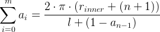

# toilet-paper-pieces
How many pieces is in roll of toilete paper? Let's find it out with Python.

I wanted to know, how much pieces of toilet paper is in roll based on several parameters.

```
ri = r_inner
ro = r_outer

      *******
   *           *
  *     ***     *
 *    *ri   * ro *
 *   *<--o------>*
 *    *     *    *
  *     ***     *
   *           *
      *******
```

`r_inner` is diameter of inner circle (roll base) \
`r_outer` is diameter of outer circle (roll base with pieces)


